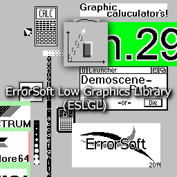

ESLowGraphicsLibrary - Low level software graphics library.
===
**ESLGL** – this is low level graphics library, optimized to 4-bit and 1-bit per pixel graphics.

Library written on “C”, but imitate PLO.

#Library supports these operations:

**BitMap functions:**
* esCreateBitMap – Create new BitMap
* esCreateStaticBitMap – Create new BitMap using a static map pixels
* esCreateStaticMaskBitMap – Create new masked BitMap using a static map pixels
* esResizeBitMap – Resize BitMap
* esCloneBitMap – Clone this BitMap
* esFreeBitMap – Free BitMap
* esFreeStaticBitMap – Free static BitMap

**BitMap effects:**
* esCopyBitMap
* esInverseBitMap
* esFlipVBitMap
* esFlipHBitMap
* esRotate90BitMap

**Main graphics:**
* esClear
* esSetPixel
* esGetPixel
* esFillRect
* esDrawRect
* esDrawLine
* esDrawEllipse
* esFillEllipse

**BitBlt(draw bitmaps) functions:**
1 bit:
* esBitBlt01_Copy
* … (more functions)
* esBitBlt01_Mask
* esBitBlt01
* esBitBltRop01

4 bit:
* esBitBlt04_Copy
* … (more functions)
* esBitBlt04_Color
* esBitBltRop04
* esBitBlt04

Universal:
* esBitBlt
* esBitBltRop

**Strech draw functions:**
1 bit:
* esStrechDraw01_Copy
* esStrechDraw01_Or
* esStrechDraw01_Xor
* esStrechDraw01_And
* esStrechDraw01_Mask
* esStrechDraw01
* esStrechDrawRop01

4 bit:
* esStrechDraw04_Copy
* esStrechDraw04_Or
* esStrechDraw04_Xor
* esStrechDraw04_And
* esStrechDraw04_Mask
* esStrechDraw04_Transparent
* esStrechDraw04_Color
* esStrechDraw04
* esStrechDrawRop04

Universal:
* esStrechDraw
* esStrechDrawRop
* other ...

Free using and editing in non commercial project, errorsoft@mail.ru or Enter256@yandex.ru for information of use in commerital project
